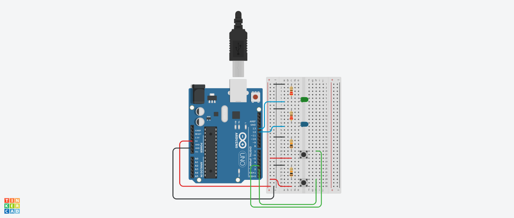

# Choose LED via Button Input — Arduino Practice Project

This Arduino project lets the user control two LEDs using two physical buttons. Each button directly controls one LED: press → LED on, release → LED off. Both buttons can be pressed at the same time. The project was designed to explore digital input handling, wiring/debugging basics, and direct real-time hardware interaction.

### Wiring Diagram

---
## Diagram and Schematic:

- [Wiring diagram PNG](./Diagrams/choose_led_button_diagram.png)
- [Circuit diagram PDF](./Diagrams/choose_led_button_schematic.pdf)

## Tinkercad:
- [Diagrams & Simulation](https://www.tinkercad.com/things/8hhdsi7ccSF-choose-led-via-button?sharecode=HT8KQxKV78Cn7eR4O6T9_MAu6U2ZwfUH0aEMW4jmCiw)

---
## Components:

- Arduino UNO (Elegoo UNO R3 or compatible)  
- Breadboard  
- 2x LEDs (green, blue)  
- 2x 220 Ω resistors
- 2x 10k Ω resistors  
- 2x push buttons  
- Jumper wires  

---
## Project Purpose

This project was created as part of my embedded systems preparation, with a focus on:

- Practicing **digital input/output** basics  
- Understanding how button states map to real-time LED control  
- Exploring **branching logic** (`if` vs. `while`) for input handling  
- Developing systematic debugging skills for both wiring and code issues  

---
## How It Works

1. Both LEDs are set to `LOW` at the start of each loop cycle.  
2. The program reads the state of both buttons using `digitalRead()`.  
3. For each button:  
   - If the state is `HIGH`, the corresponding LED turns on.  
   - If the state is `LOW`, the corresponding LED turns off.  
4. Both buttons can be pressed together to light both LEDs simultaneously.  
5. The behaviour is real-time: no delays or latching.  

---
## Key Learning Notes

- Initial bugs came from using **pin numbers** directly in conditions instead of the **read state variables**.  
- Wiring issues (loose jumper wires, incorrect button setup) can appear as code errors — always test hardware connections first.  
- Using simple `if` statements allowed both LEDs to respond independently; `while` loops would have blocked execution.  
- Debugging required combining serial output checks with careful rewiring.  

---
## Documentation Workflow & AI Assistance

All documentation in this project (README, dev logs, and code comments) is based on original notes written manually during development.

To improve clarity and consistency, AI tools are used to:

- Draft new READMEs from raw notes
- Generate dev logs tracing reasoning and changes
- Condense raw notes into concise in-code comment blocks

**All generated documentation is manually reviewed and edited.** 