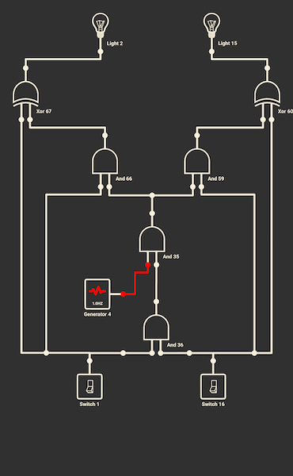
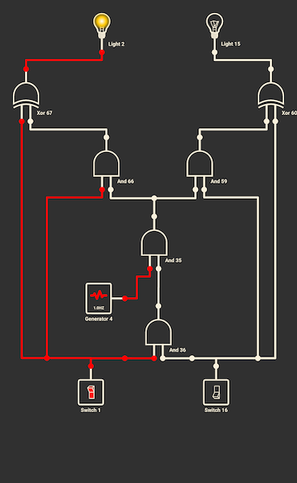
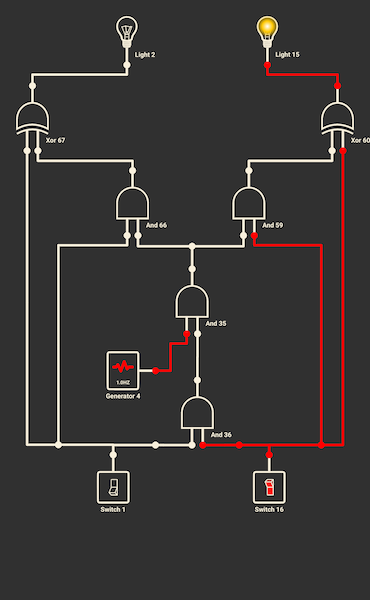
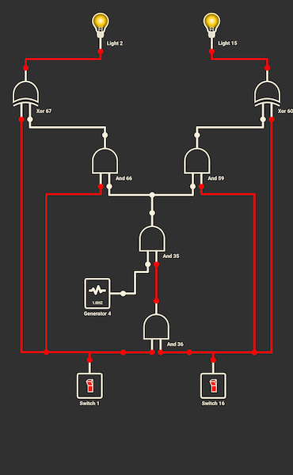
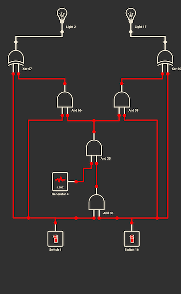

# Part 1 — Logic Circuit Design

_(Digital Logic Practice: Arduino Photoresistor + Button Project)_

---
## Goal and Rationale

The goal of this part was to **translate the Arduino photoresistor + button sketch** into a **pure logic circuit**—no microcontroller, no code.  
Instead of defining behaviour in `loop()` and `if` statements, the objective was to **hard-wire that logic** directly through gate combinations.

This exercise links my Arduino practice with the _Computer Systems_ course content, turning programming flow control into actual electrical signal relationships.

---
## Concept and Approach

### Step 1 — Define Behaviour to Reproduce

The original sketch logic:

- If **only the photoresistor** detects light → **LED 1** turns on.

- If **only the button** is pressed → **LED 2** turns on.

- If **both** are active → **both LEDs blink together** in a loop.

The circuit therefore needs **two independent outputs** that behave statically under single-input conditions and dynamically when both inputs are HIGH.

---
### Step 2 — Translating Software Logic to Hardware Logic

Inputs:

- **A = Photoresistor** (HIGH = light detected)

- **B = Button** (HIGH = pressed)

- **G = Generator** (toggles HIGH/LOW → replaces Arduino’s timing loop)

Outputs:

- **Q₁ = LED 1** (controlled primarily by A)

- **Q₂ = LED 2** (controlled primarily by B)

The blinking condition, _both inputs HIGH_, means the generator’s signal must pass through only when A AND B = 1.

---
### Step 3 — Implementing the Generator Logic

A **signal generator** was added as a third input to emulate Arduino’s repetitive loop behaviour.  
To route the generator correctly:

- **AND gates** ensure the generator affects LEDs **only when both A and B are HIGH**.

- **XOR gates** alternate the ON/OFF state of the LEDs in sync (but phase-inverted) with the generator.

This produced the desired effect: each LED works independently when only one input is HIGH, but when both inputs are HIGH, **both blink together**.

---
## Circuit Implementation

### Components

- Inputs: `A`, `B`, `G`

- Gates: `AND`, `OR`, `NOT`, `XOR`

- Outputs: `Q₁` (LED 1), `Q₂` (LED 2)

### Behaviour Table

| A (PR) | B (Button) | G (Generator) | Q₁ (LED 1) | Q₂ (LED 2) | Description                    |
| :----: | :--------: | :-----------: | :--------: | :--------: | ------------------------------ |
|   0    |     0      |       *       |     0      |     0      | Both off                       |
|   1    |     0      |       *       |     1      |     0      | Only LED 1 on                  |
|   0    |     1      |       *       |     0      |     1      | Only LED 2 on                  |
|   1    |     1      |       0       |     1      |     1      | Both LEDs on (generator LOW)   |
|   1    |     1      |       1       |     0      |     0      | Both LEDs off (generator HIGH) |

### Circuit Snapshots:

#### A = B = 0:

#### A = 1, B = 0:

#### A = 0, B = 1:

#### A = B = 1, C = 0:

#### A = B = 1, C = 1:

