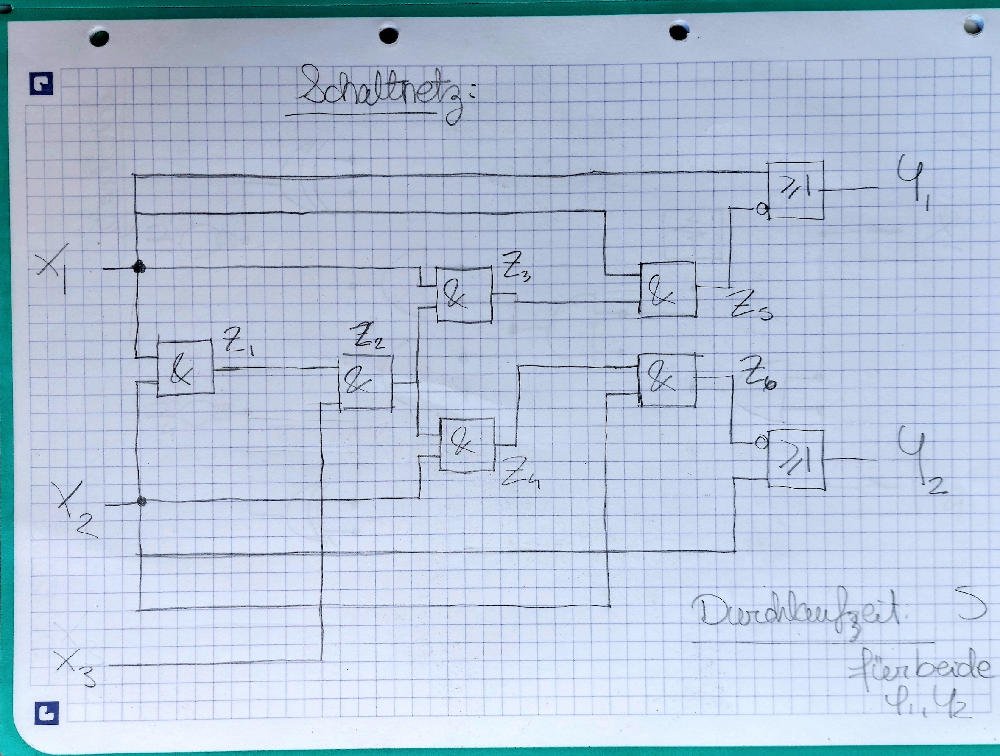
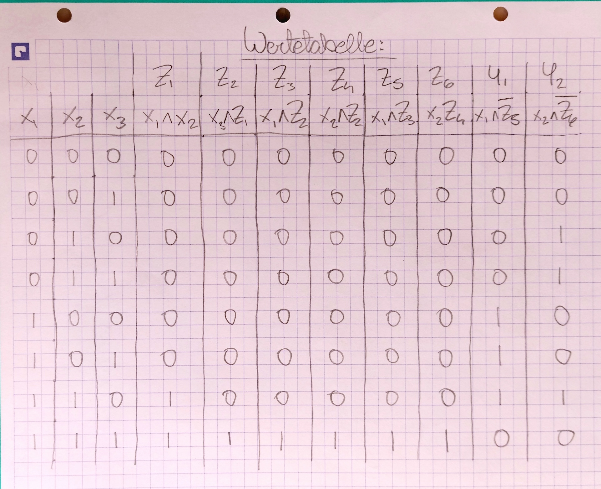
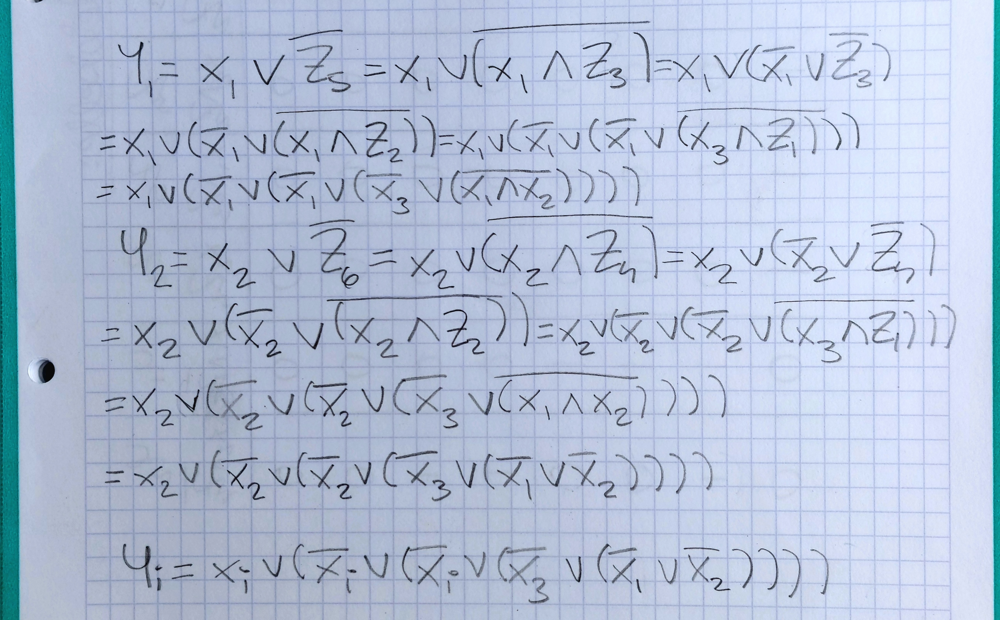

# Part 2 — Boolean Algebra & Logic Function Analysis

_(Digital Logic Practice: Arduino Photoresistor + Button Project)_

---
## Goal and Rationale

After completing the logic circuit simulation in Part 1, this phase focused on **expressing the circuit mathematically** and analysing its behaviour using **Boolean algebra**.  
The objective was to move from the **visual and physical** representation of the system (inputs, LEDs, generator) to a **symbolic and analytical** understanding of how signals interact and how those relationships can be simplified.

This process connects course concepts—truth tables, logic functions, SOP/POS forms, and Karnaugh maps—to a **real, observed circuit** rather than textbook abstractions.

---
## Concept and Approach

### Step 1: Define Analytical Scope

Inputs:

- **x₁ = Photoresistor** (HIGH = light detected)

- **x₂ = Button** (HIGH = pressed)

- **x₃ = Generator** (alternating HIGH/LOW signal)

Outputs:

- **y₁ = LED 1** (responds to x₁)

- **y₂ = LED 2** (responds to x₂)

When both x₁ and x₂ are HIGH, both LEDs blink according to x₃.

### Step 2: Redrawing with Base Gates Only

For analysis, the circuit was redrawn **using only AND, OR, NOT gates**—no XOR.  
This made each intermediate expression explicit and allowed direct translation into Boolean functions.

### Step 3: Sketching Function Formula

Using the new circuit diagram, the intermediary functions were mapped and used to create an extended form truth table.

The function formula using intermediary functions was written then extended to only expressions containing the input variables.

---
## Truth Table

| x₁  | x₂  | x₃  | y₁  | y₂  | Behaviour Description          |
| :-: | :-: | :-: | :-: | :-: | ------------------------------ |
|  0  |  0  |  *  |  0  |  0  | Both off                       |
|  1  |  0  |  *  |  1  |  0  | Only LED 1 on                  |
|  0  |  1  |  *  |  0  |  1  | Only LED 2 on                  |
|  1  |  1  |  0  |  1  |  1  | Both LEDs ON (generator LOW)   |
|  1  |  1  |  1  |  0  |  0  | Both LEDs OFF (generator HIGH) |

---
## Planned Extensions (To-Do)

1. **Minterm and Maxterm Enumeration**  
     List all minterms for each LED output.

2. **SOP / POS Forms**  
     Write the canonical and simplified expressions.

3. **Karnaugh Map Analysis**  
     Visualise simplification and identify redundant terms.

4. **Reduced Form**  
     Determine minimal expressions for Q₁ and Q₂ using Boolean identities.

5. **Timing and Runtime Notes**  
     Relate logical simplification to potential gate-count and latency reduction.

_(These sections will be expanded as detailed notes and diagrams are uploaded.)_

---

## Reflections and Insights

### From Static to Dynamic Thinking

Until this point, my work with digital logic had been **static**—truth tables describing fixed states.  
Introducing the **generator input** brought time into the picture.  
I learned to think of truth tables not just as snapshots but as **time-dependent relationships** where one variable represents continuous toggling.

### Bridging Mathematics and Real-Time Behaviour

Writing the logic functions clarified how **physical blinking** is simply a mathematical expression evaluated repeatedly at high speed.  
It made Boolean algebra feel tangible—the equations directly mapped to observed LED timing.

### Understanding Runtime at the Gate Level

Through function analysis, it became clear that **gate arrangement influences propagation delay**.  
What looks like an instantaneous logical result actually involves **signal latency**, which links Boolean simplification to real-world efficiency.

### Conceptual Gains

- Concrete sense of how **clock-like signals** govern dynamic systems.

- Reinforced intuition about the **connection between microcontroller loops and clock cycles**.

- Recognition that both software and hardware are just different layers of logical abstraction.

---
## Summary of Learning

- Applied formal **Boolean algebra** to a circuit derived from Arduino behaviour.

- Transitioned from simulated gates to **symbolic logic analysis**.

- Expressed dual-output relationships using mathematical functions.

- Recognised the impact of real-time signal alternation on logic modelling.

- Strengthened understanding of **how algebraic simplification affects physical implementation**.

- Built a clearer bridge between **course theory** and **embedded systems practice**.

---
## Supporting Material

- Hand-drawn logic diagram (AND/OR/NOT only)

- Annotated truth table

- Intermediate-function breakdown and extended form

- Simplification worksheets (to be added)

- Karnaugh maps (to be added)

---

### Next Step

**Part 3 — Function Simplification and Optimisation**, where minterm expansion, K-maps, and reduced-form expressions will be finalised and linked to timing and efficiency analysis.