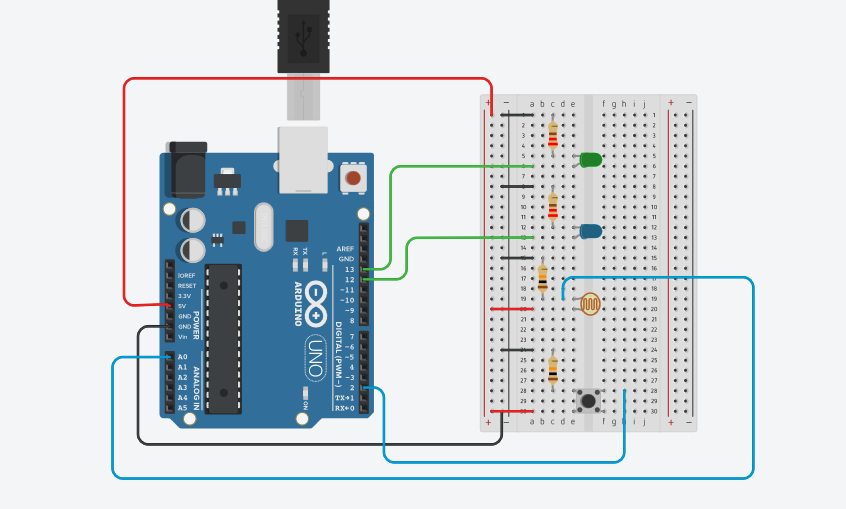

# Choose LED via Button & Photoresistor Input — Arduino Practice Project

This Arduino project lets the user control two LEDs using either a push button or a photoresistor. Each input source can turn on one LED individually, or both LEDs simultaneously blink when both inputs are active. The project explores **digital and analog input handling**, boolean logic, and multi-condition LED control in real time.

### Digital Logic:

This project served as basis for practicing applying digital logic and boolean algebra theory.
See the [Digital Logic](./Digital_Logic) folder for combinational logic circuit simulation and boolean function analysis.

---
### Demo & Diagrams:

- [Wiring diagram PNG](./Diagrams/choose_led_button_pr_wiring.png)
- [Schematic PDF](./Diagrams/choose_led_button_pr_circuit.pdf)
- [Large demo GIF](./Diagrams/PR_button.gif)
- [Tinkercad Simulation](https://www.tinkercad.com/things/jsYlz6c3gEr-pr-button-leds?sharecode=-ilognyc5JtOtq1TzNFPMRr5hzVQ9PlOq6Me02jovhg)

---
## Components:

- Arduino UNO (Elegoo UNO R3 or compatible)  
- Breadboard  
- 2x LEDs (green, blue)  
- 1x push button  
- 1x photoresistor  
- 2x 220 Ω resistors  
- 2x 10k  Ω resistors  
- Jumper wires  

---
## Project Purpose

This project was created as part of my embedded systems preparation, focusing on:

- Practicing **digital & analog input handling**  
- Exploring **boolean arithmetic** in C++ for flag variables  
- Handling **multi-source input logic** (button, photoresistor, or both)  
- Understanding **reset checkpoints** and loop-based LED control  
- Learning how to combine **conditional branches and while loops** for different input states  

---
## How It Works

1. At the start of each loop, both LEDs are reset to `LOW` based on current input states.  
2. Inputs are read: `digitalRead()` for the button, `analogRead()` for the photoresistor.  
3. Boolean flag variables are defined to represent:  
   - **Photoresistor only active**  
   - **Button only active**  
   - **Both inputs active**  
4. Logic branches:  
   - If **photoresistor only** → green LED turns on  
   - Else if **button only** → blue LED turns on  
   - Else if **both inputs** → both LEDs blink while both inputs remain active  
5. After each iteration or blink cycle, input readings are updated to allow real-time responsiveness.  

---
## Key Learning Notes

- Boolean arithmetic can simplify multi-condition logic, given that flag variables be updated in each loop iteration.  
- Resetting LEDs at the start of the loop prevents unwanted “stuck” or blinking LEDs.  
- Using a `while` loop for simultaneous inputs allows blinking behaviour without blocking other inputs indefinitely.  
- Analog thresholds for the photoresistor were chosen experimentally (`value <= 450`) to detect low light conditions.  
- Combining multiple input sources requires careful sequencing of `if` / `else if` statements to avoid conflicts. 
- Unlike previously assumed, boolean variables exist in Arduino C++.

---
## Documentation Workflow & AI Assistance

All documentation in this project (README, dev logs, and code comments) is based on original notes written manually during development.

To improve clarity and consistency, AI tools are used to:

- Draft new READMEs from raw notes
- Generate dev logs tracing reasoning and changes
- Condense raw notes into concise in-code comment blocks

**All generated documentation is manually reviewed and edited.** 

