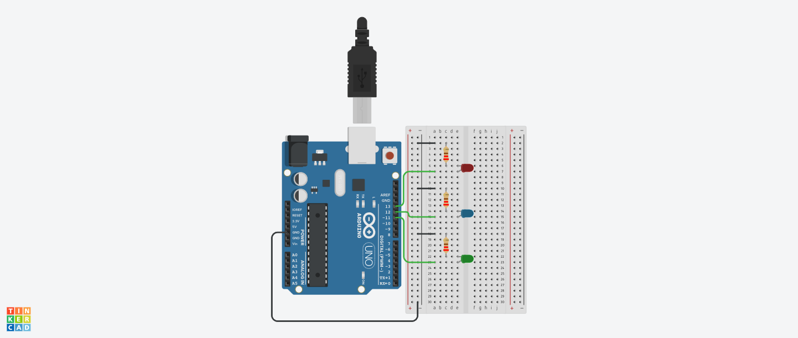

# 🔌 Choose LED via Serial Input — Arduino Practice Project

This small Arduino project lets the user choose a coloured LED (Red, Blue, Green) to light up using input via the serial monitor. It was designed to explore core input/output behaviour, basic conditionals, and timing issues when using the `Serial` interface. The project prioritises input handling clarity, user feedback, and troubleshooting experience.

### 🔧 Wiring Diagram



---
## 💡 Diagrams and Demo:

- [Wiring diagram PNG](https://github.com/s-0-p-h-i-a/Arduino_Practice/tree/main/Choose_LED_Serial/Diagrams_and_Demo/choose_led_serial_wiring.png)
- [Circuit diagram PDF](https://github.com/s-0-p-h-i-a/Arduino_Practice/tree/main/Choose_LED_Serial/Diagrams_and_Demo/choose_led_serial_circuit.pdf)
- _(planned)_ Demo

## ⚡️ Tinkercad:
- [Diagrams & Simulation](https://www.tinkercad.com/things/80gbNEcKRgH-choose-led-via-serial?sharecode=n9BNBrZXaVYD4yKGmNLrOhBrsblqBlJRCTXiEIaLozY)

---
## 🧩 Components:

- Elegoo UNO R3
- Breadboard
- 3x LEDs: red, blue green
- Blue LED
- Green LED
- 3x 220 Ω Resistor
- 7 wires

---
## 🎯 Project Purpose

This project was created as part of my embedded systems preparation, with a focus on:

- Practicing **Serial I/O** fundamentals

- Handling **char vs. string vs. int** inputs cleanly

- Exploring **timing mismatches** between Serial communication and program speed

- Building intuitive feedback mechanisms (via LEDs + Serial messages)

- Experimenting with **error responses** like blinking LEDs

---
## ⚙️ How It Works

1. All LEDs are turned off at the beginning of the loop.

2. The user is prompted to choose an LED via serial input:

	- `1` = Red

    - `2` = Blue

    - `3` = Green

3. Input is read as a string and converted to an integer.

4. A `switch` statement maps the chosen number to the appropriate LED pin.

5. If the input is valid, the corresponding LED lights up for 3 seconds.

    - If the input is invalid, all LEDs flash three times and an error message is printed.

6. The chosen LED is turned off before the next loop iteration.

---
## 🧠 Key Learning Notes

- `Serial.read()` only works with `char` data — using `Serial.readStringUntil('\n')` + `toInt()` solved type mismatch issues

- Without newline handling, the loop was re-running with leftover input (e.g., `\n`) triggering error branches

- Used `validInput` flag to separate clean/dirty input cases cleanly

- LED pin mapping and feedback were handled via separate `switch` statements for logic clarity

- LED error blinking was introduced as a visual debugging feature

---
## 🗃️ File Structure

```
Choose_LED_Serial/
├── Diagrams_and_Demo   			# Tinkercad wiring & circuit diagrams, planned demo video
└── Choose_LED_Devlog.md            # Dev Log
└── Choose_LED_README.md            # This file
└── choose_LED_serial.ino   		# Main program file
```

---
## 🚧 Next Steps

- Make and link process video

- Create a sibling project: **Choose LED via Button Input**

- Refactor shared LED-handling logic into functions for reuse

- Explore input debounce strategies

- Consider using arrays for pin mapping

---
### 🧠 Documentation Workflow & AI Assistance

All documentation in this project (README, dev logs, and code comments) is based on original engineering notes taken during development. These notes are written manually on top of the `.cc` source file as I work.

To improve clarity and structure, I use AI tools selectively to assist with formatting, polishing, and summarising the content — particularly for:
- Drafting new README versions based on raw notes and previous versions
- Generating development logs that clearly trace design decisions, also based on raw notes and previous versions
- Condensing raw notes into opening in-code documentation blocks

All AI-assisted outputs are reviewed and edited by me. No code, decisions, or technical content are generated or altered without verification and approval.  
Raw notes are preserved in a dev diary folder for traceability and transparency.

This workflow is designed to maintain both high clarity and authorship integrity.

---

**Built with wires, curiosity, and C++ logic.**

_This Arduino program is part of a larger project series to explore embedded development foundations._
