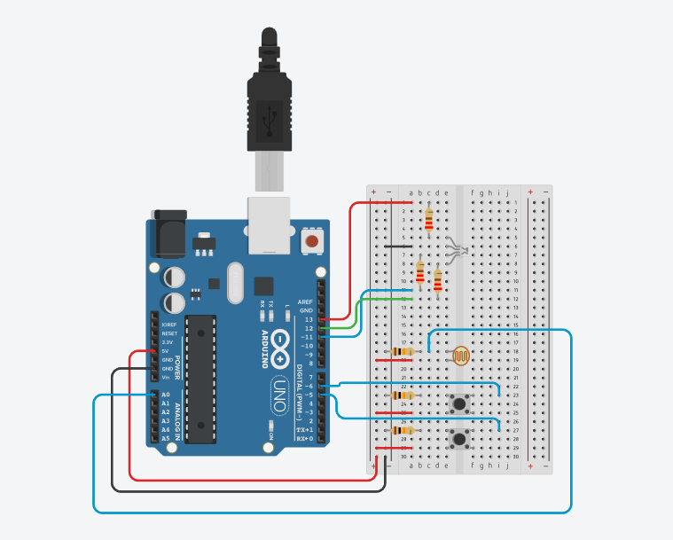

# RGB LED + Photoresistor + Buttons

## Goal:
- Control an RGB LED using two buttons and a photoresistor, combining digital and analog inputs.
Initially intended for Serial-based PWM brightness control, the project evolved into a debugging and signal-processing study analyzing photoresistor response, smoothing behaviour, and hardware timing limits.
---
## Demo & Diagrams

- [Wiring diagram PNG](./Diagrams/RGB_LED_PR_diag.png)
- [Schematic PDF](./Diagrams/RGB_LED_PR.pdf)
- [Large demo GIF:](./Diagrams/RGB_PR_1.gif) main project
- [Large demo GIF: ](./Diagrams/RGB_PR_2.gif) hysteresis experiment
- [Large demo GIF: ](./Diagrams/RGB_PR_3.gif) Serial Plotter view of raw + smoothed photoresistor value, and red + green channel values
- [Tinkercad Simulation](https://www.tinkercad.com/things/jsYlz6c3gEr-pr-button-leds?sharecode=-ilognyc5JtOtq1TzNFPMRr5hzVQ9PlOq6Me02jov)

---
## Components
| Component                 | Quantity | Purpose                                                   |
| ------------------------- | -------- | --------------------------------------------------------- |
| Arduino Uno               | 1        | Main controller                                           |
| RGB LED (common cathode)  | 1        | Visual output                                             |
| Photoresistor (LDR)       | 1        | Light sensor to influence blue LED behavior               |
| Push buttons              | 2        | Control red and green LEDs                                |
| 10kΩ resistors            | 3        | Pull-down / voltage divider for photoresistor and buttons |
| LED resistors (~220Ω)     | 3        | Current limiting for RGB LED channels                     |
| Jumper wires + breadboard |          | Circuit connections                                       |

---
## Learning Focus

This project was an **embedded programming and debugging exercise**, not just a wiring or LED control task.

### Key learning areas:
- **Embedded I/O logic**
  - Handling digital and analog input pins.
  - Understanding the analog signal range (0–1023) and mapping to output PWM (0–255).
  
- **Timing and synchronisation**
  - Experimented with delays to manage Serial I/O flow and sensor reading latency.

- **Serial communication**
  - Tested input validation and type conversion (`Serial.parseInt()`, byte cleanup).
  - Observed behaviour differences between `Serial` and `std::cin`.

- **Hardware debugging**
  - Diagnosed flickering and noise caused by wiring proximity and grounding.
  - RGB channels behaved as if they did not support analog brightness (binary cutoff around 128).

- **System reasoning**
  - Learned to isolate faulty behaviour by progressively disabling subsystems (e.g., serial input, button loop).
  - Explored how timing misalignments between hardware response and program loop can cause unstable states.

---
## Program Structure

### **1. Original version (intended design)**

- File: [RGB_LED_PR+BUTTONS_test.ino](./RGB_LED_PR+BUTTONS_test.ino)
#### Overview:
- Combined **Serial input** for brightness setup and **sensor/button** feedback for real-time control.
- Loop structure:
  1. Ask for red and green brightness levels.
  2. Stay in a behaviour loop reacting to buttons and photoresistor input.
  3. Exit on Serial input activity.
- Included modularised function `getLevel()` for reading and validating user brightness values.
- Started with blocking Serial read using delay(), stuck with this format to experiment and find out how much delay is needed to adapt sketch runtime with Serial lag
#### Main functions:
| Function | Purpose |
|-----------|----------|
| `getLevel(String colour)` | Reads desired brightness level (0–100%) from Serial, validates input, converts to 0–255 scale |
| `loop()` | Main control logic: manages inputs, updates LED outputs, and checks for Serial exit signal |
#### Limitation found:
- LED legs only supported full ON/OFF states; analog PWM had no visible effect.
- Serial timing and leftover byte issues created unstable or ignored input events.
#### Code structure:
- See Dev Log for snippet

---
### **2. Final working version (hardware-limited design)**

- File: [RGB_LED_PR+BUTTONS.ino](./RGB_LED_PR+BUTTONS.ino)
#### Overview:
Simplified to direct binary control due to LED limitations:
- Buttons toggle red and green channels (digital read).
- Photoresistor threshold controls blue channel (analog read, mapped to boolean condition).
#### Behaviour logic:
| Input | Effect |
|--------|---------|
| Button 1 pressed | Red LED ON |
| Button 2 pressed | Green LED ON |
| Low light on photoresistor | Blue LED ON |
| Bright light on photoresistor | Blue LED OFF |
#### Code structure summary:
- See Dev Log for snippet

---
### **3. Signal Processing + Hysteresis + Serial Plotter version**

- File: [Plotter_and_Hysteresis/PR_buttons_RGB_test2.ino](./Plotter_and_Hysteresis/PR_buttons_RGB_test2.ino)

#### Overview:
- Uses photoresistor input to drive **smoothed LED output** via PWM.
- Red and green channels scale with sensor input, with discrete thresholds to simulate hysteresis.
- Serial output visualized in Serial Plotter for debugging and analysis.

#### Behaviour logic:
| Input | Effect |
|--------|---------|
| Photoresistor low | Red LED brighter, blue LED near max |
| Photoresistor mid | Green LED activates in defined range, blue LED dims |
| Photoresistor high | Blue LED decreases, red/green adjust according to thresholds |
| Serial input | (optional) can define red/green target levels |

---
# Lessons Learned

Hardware constraints matter:
    Logical implementation must align with physical behaviour.

Debugging as learning:
    Most insights came from analysing why things didn’t work as expected.

Timing sensitivity in microcontrollers:
    Serial and analog reads don’t behave like standard console I/O — they need synchronisation.

Incremental testing is critical:
    Stripping features down to isolate causes of misbehaviour proved to be the most effective debugging method.

---
# Next Steps

Reintroduce getLevel() and Serial control for adjustable brightness.

Use non-blocking Serial reads and proper event-driven handling.

Document each test cycle systematically (Dev Log).

---
# Purpose

Proof of practice: Real embedded debugging and system behaviour analysis.

Reference base: For later, more complex Arduino and microcontroller projects.

Study record: Captures iterative reasoning, not just final functionality.

---
## Documentation Workflow & AI Assistance

All documentation in this project (README, dev logs, and code comments) is based on original notes written manually during development.

To improve clarity and consistency, AI tools are used to:

- Draft new READMEs from raw notes
- Generate dev logs tracing reasoning and changes
- Condense raw notes into concise in-code comment blocks

**All generated documentation is manually reviewed and edited.** 
