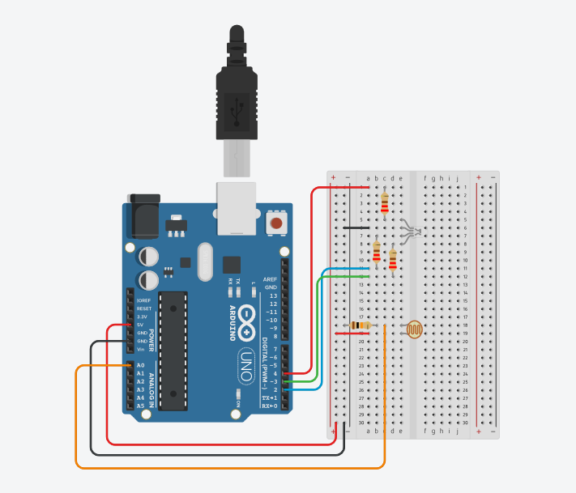

# RGB LED Hysteresis + Serial Plotter Experiment
**Date:** 10–11 October  
**Hardware:** RGB LED (common cathode), resistors, photoresistor, Arduino R3

---
## Goal
- Regulate the RGB LED color and intensity using a photoresistor as input and visualize behavior via the Serial Plotter.  
Originally an offshoot of the RGB_LED_Photoresistor project, this version focuses on data visualisation, sensor-driven hysteresis and signal processing.

---
## Diagram & Demo GIFs

- [Large demo GIF: ](https://github.com/s-0-p-h-i-a/Arduino_Practice/tree/main/RGB_LED_PR%2BBUTTONS/Diagrams/RGB_PR_2.gif) hysteresis experiment
- [Large demo GIF: ](https://github.com/s-0-p-h-i-a/Arduino_Practice/tree/main/RGB_LED_PR%2BBUTTONS/Diagrams/RGB_PR_3.gif) Serial Plotter view of raw + smoothed photoresistor value, and red + green channel values
---
## Hardware Setup
| Component | Pin | Function |
|------------|-----|-----------|
| Red LED leg | D4 (PWM) | Variable brightness |
| Green LED leg | D3 (PWM) | Variable brightness |
| Blue LED leg | D2 (PWM) | Variable brightness |
| Photoresistor | A0 | Analog input (0–1023) |

Common cathode to **GND**.  
Common anode wiring to **5V** was tested but caused non-linear PWM behavior.

---
## Code Overview
### Structure
1. **Setup:** Configure LED pins and serial connection.
2. **Loop:**
    - Read photoresistor value (`currentSensorValue`).
    - Average it with previous reading (`lastSensorValue`) for smoother output.
    - Map scaled sensor values to RGB brightness levels.
    - Output levels to LEDs via `analogWrite()`.
    - Send all values to Serial Plotter for live visualization.

### Key Mappings
| Variable | Formula | Description |
|-----------|----------|-------------|
| `averageSensorValue` | `(current + last)/2` | Basic smoothing to reduce flicker |
| `redLevel` | `(sensor * 255 / 1023) - 100` | Adjusted downward to highlight low-end transitions |
| `greenLevel` | `(sensor * 255 / 1023) - 200` | Offset for staggered activation |
| `blueLevel` | `255 * (1 - sensor/1023)` | Inverse brightness behavior |
| Ratio (for plotting) | `100 / 1023` | Convert raw readings to % scale |

### Serial Output Format

Sensor_Value:XX, Average_Value:XX, Red_Level:XX, Green_Level:XX

---
## Behavior & Observations
- Blue LED brightness varies smoothly with light intensity.
- Red and green LEDs activate in separate ranges to simulate hysteresis.
- Averaging (`averageSensorValue`) significantly reduces flicker.
- Plotting scaled button and LED values on the same axis helps visualize thresholds and range transitions.
- LED brightness remains non-linear — observed hardware cutoff around PWM value ~128.
- Common anode wiring caused unexpected binary-like switching; reverted to GND-based setup.

---
## Debug Log Highlights
- Rewiring reduced interference and flicker.
- Serial input timing required careful delay placement; now stable.
- Switching to PWM pins enabled analog brightness control.
- Averaging introduced smoother transitions, better for plotting.
- Removed code: button inputs scaled by ×300 to visualize state changes on Serial Plotter along with the other displayed values.
- Offset tuning (−100, −200) created clearer red/green activation ranges.
- Brightness modulation still limited by LED’s physical response (possible cutoff threshold).

---
## Lessons & Next Steps
- Explore moving average smoothing and edge case handling for steadier hysteresis.
- Test individual color LEDs for isolated brightness gradation.
- Consider defining hysteresis thresholds dynamically (e.g., `greenON` and `redON` with buffer zones).
- Integrate buttons again for manual override / mode switching.

---
## Summary:  
This experiment established a working proof-of-concept for combining analog sensor data with PWM-driven RGB output and live signal visualisation. It also highlighted the limits of LED hardware brightness control and the importance of careful wiring and timing + averaging in sensor-driven feedback loops.

---
## Documentation Workflow & AI Assistance

All documentation in this project (README, dev logs, and code comments) is based on original notes written manually during development.

To improve clarity and consistency, AI tools are used to:

- Draft new READMEs from raw notes
- Generate dev logs tracing reasoning and changes
- Condense raw notes into concise in-code comment blocks

**All generated documentation is manually reviewed and edited.** 
